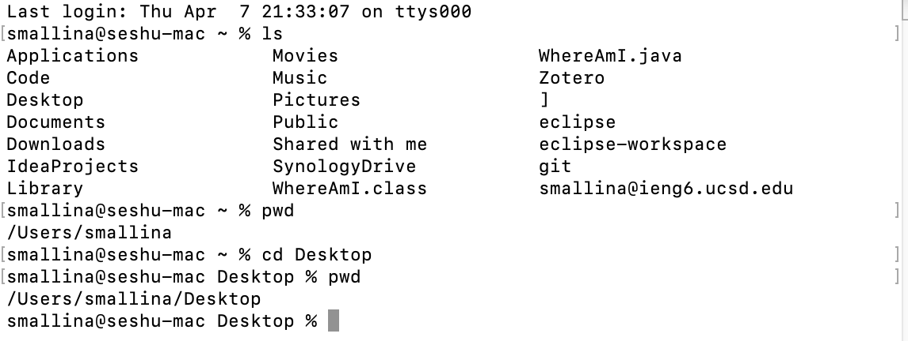

**Lap Report 1** 

In this lab report I will go over how to download and install VS.Code, remotely connecting to UCSD's servers, basic terminal commands, moving files, setting an SSH key, and optimize remote running.

**Step 1: Download VS.Code**

Click the link below to download VS.Code IDE respective to your machine (OS or Windows).

[VSCode link for download](https://code.visualstudio.com/download)

The VS.Code should be in your download file. Once its done downloading double click to to open application. 

You should see a screen like this: 

 

**Step 2: Remotely Connect to UCSD's Server**

[Install SSH](https://docs.microsoft.com/en-us/windows-server/administration/openssh/openssh_install_firstuse)

For OS users you can use the in built terminal on your device by pressing ⌘ + space and then typing in "terminal". 

Should look like this:


A small white window should pop up like this: 


Now type this command into your terminal to remotely connect to UCSD's server. 

**Command:** ssh cs15lsp22zz@ieng6.ucsd.edu

**Caution:** you should use your own email assigned to you not the one listed above. 

[To find you email that is associated to you go here](https://students.ucsd.edu/campus-services/technology/computers/index.html)

Then you should enter the password of your AD login. Then you should have access to the server. 

This is what your screen should present:


Then press ⌘ + D to exit the server.

**Step 3: Trying Some Commands**

Open up your terminal using ⌘ + space and then typing terminal in the search bar.

Click the link to see different terminal commands. 
[Terminal Commands](https://www.makeuseof.com/tag/mac-terminal-commands-cheat-sheet/)

Now in your terminal lets practice some terminal commands.

Enter **ls** in your terminal like this:


ls terminal command prints all the files and subdirectories of the current file your in. 

Enter **pwd** in your terminal:


pwd terminal command prints your working directory or where exactly you are in your computer. 

Enter **cd (name of file that was printed with the ls command)**.


cd terminal command changes your current directory to the new directory that you chose. **cd .** command takes you up one file, **cd..** command takes you up two files, and **cd ~** takes you to the root directory. 

Then enter **pwd**. Your current location should have changed because you have entered a different directory. 



Then enter **clear**.


clear terminal command clears the terminal. 

**Step 4: Moving Files with scp**

Open up your terminal using ⌘ + space and then typing terminal in the search bar. 

Type **vim (name of file).java**. Then click enter to create a new file. Type I then click enter. You should see insert at the bottom left corner. This means that you are currently editing the file that you created. 


Copy and Paste the code below: 
```java
    class WhereAmI {

        public static void main(String[] args) {

            System.out.println(System.getProperty("os.name"));
            System.out.println(System.getProperty("user.name"));
            System.out.println(System.getProperty("user.home"));
            System.out.println(System.getProperty("user.dir"));
        }

    }
```

 

Then click the esc key. This means that your done editing your file. Then type the command ":wq" to save and quit the file that you made. 

Then compile and run the java program that you made using the commands: 

Compile Java File: javac (filename)

Run Java File: java (filename)

 

Once the java program compiled and ran. Enter this command: **scp WhereAmI.java cs15lsp22zz@ieng6.ucsd.edu:~/**

**Caution: remember to use the email assigned to you** 

Then you should enter your password. 

Now enter the ssh command to login into the sever and enter your password. Now use the terminal command ls the file that you created on your home directory should pop up in the UCSD server. Now you can compile and run your program using javac and java. 

 

**Step 5: Setting up an SSH key** 

Type in the terminal command ssh-keygen. 

This should generate a public and private rsa key pair. Then enter the file that you want to save the key in. After that, then enter the passphrase that you want to use to protect that key. 

The terminal should then out put a random fingerprint/diagram. 


Then log in to the UCSD server using your assigned email and password. Once you are connect use the terminal command **mkdir .ssh** to make a new directory .ssh. Logout of the server with control D.


Then type this **scp /Users/<user-name>/.ssh/id_rsa.pub cs15lsp22zz@ieng6.ucsd.edu:~/.ssh/authorized_keys** into the terminal. 


*Sidenote: use the username and the path that you saw. 

**Step 6: Optimize Remote Running** 

To run commands directly on the server you can use "" around the terminal command.

For example: 
**ssh cs15lsp22zz@ieng6.ucsd.edu "ls"** would log you into the server and run the command ls which would print out all the files and subdirectories. 

Additionally, having semicolons between commands allows mutiple commands to run at once.

For example: 
**cp WhereAmI.java OtherMain.java; javac OtherMain.java; java WhereAmI** would copy the file WhereAmI.java, compile it, and run the program. 


*Sidenote: pressing the up arrow key will allow to access previous terminal commands that you performed.*


**Conclusion**

This concludes lab report 1. In this lab report I went over how to download and install VS.Code, remotely connecting to UCSD's servers, basic terminal commands, moving files, setting an SSH key, and optimize remote running. Thanks for reading. 


