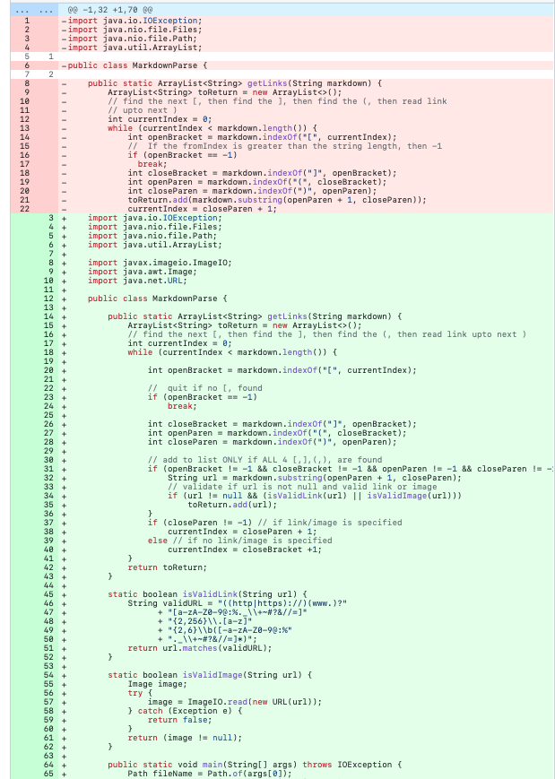
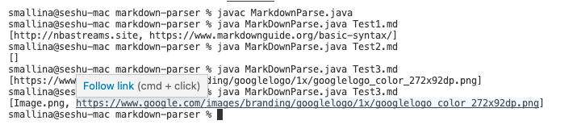

# Lab Report 2 

In this lab report I will go over the three code changes that our group worked on in lab 3 to fix a bug. 

# Code change 1

[Failure Inducing Input: Space](https://github.com/smallinaUCSD/markdown-parser/blob/main/Test1.md) 

The failure inducing input is that the java program can not handle new line character when parsing the markdown file to find the links. The bug in the system is that code can not handle new lines. As a result of this bug, the symptom is that is an infinite loop. 

# Code change 2

[Failure Inducing Input: No Link](https://github.com/smallinaUCSD/markdown-parser/blob/main/Test2.md)

The failure inducing input is that the java program can not deal with the condition []. The bug in the system is that code can not an empty file. As a result of this bug, the symptom is that is an index out of bounds error. 

# Code change 3

[Failure Inducing Input: Close Brackets + text](https://github.com/smallinaUCSD/markdown-parser/blob/main/Test3.md)

The failure inducing input is that the java program can not [] with text. The bug in the system is that code can not handle this boundry condition. As a result of this bug, the symptom is that is an index out of bounds error.

# Code Works 

# Conclusion

In this lab I went over three different failure induced errors, explained their bug and symptom. My Ta said that if our code change fixed all three bugs we can use the same program for all three code changes.