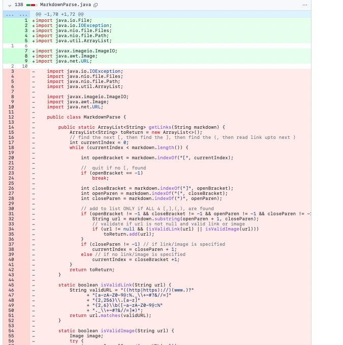
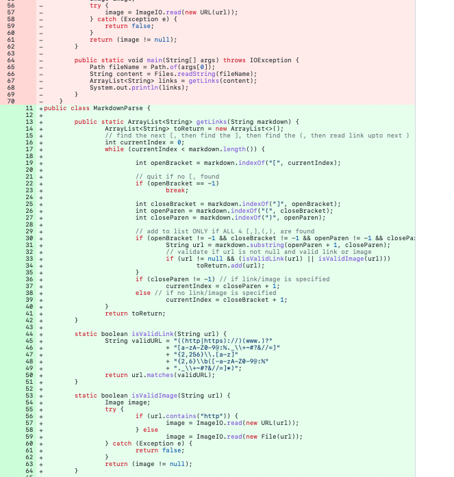
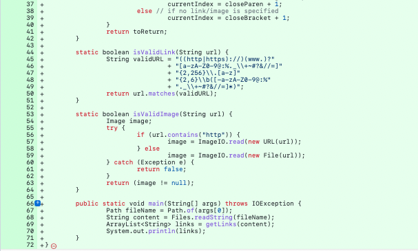
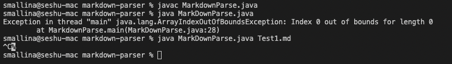
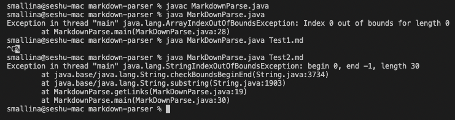
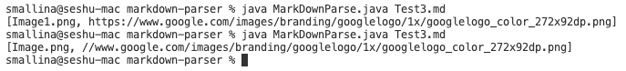
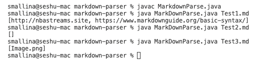

# Lab Report 2 

In this lab report I will go over the three code changes that our group worked on in lab 3 to fix a bug. 

# Code change 1

 

[Failure Inducing Input: Space between Links](https://github.com/smallinaUCSD/markdown-parser/blob/main/Test1.md) 

The failure inducing input is spaces between links. The bug is the missing boundry condition check to exit the while loop when there are no more ], found in the markdown string. As a result of this bug, the symptom is an infinite loop.

I control + C to terminate the infinite loop as shown in the image above.

# Code change 2

[Failure Inducing Input: No Link](https://github.com/smallinaUCSD/markdown-parser/blob/main/Test2.md)

The failure inducing input is that the java program can not deal with the condition of a markdown file with no links. The bug in the system is that code can not an empty link with missing (). As a result of this bug, the symptom is that is an index out of bounds error. 

The original code provided gave an index out of bounds error.

# Code change 3

[Failure Inducing Input: Image Invalid URL or File](https://github.com/smallinaUCSD/markdown-parser/blob/main/Test3.md)

The failure inducing input is that the java program can not handle invalid images. The bug in the system is that code can not handle images having invalid url patterns or files. As a result of this bug, the symptom is that is an index out of bounds error.

The original code provided gave an invalid url. 

# Code Works 

# Conclusion

In this lab I went over three different failure induced errors, explained the relationship between its bug and symptom. My Ta said that if our code change fixed all three bugs we can use the same program for all three code changes.