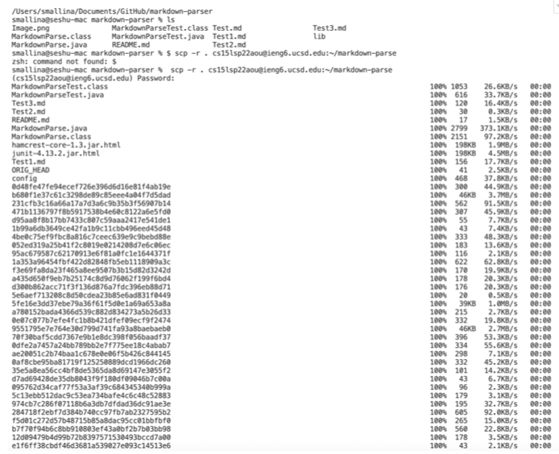

# Lab Report 3

In this lab report I will go over streamlining ssh configuration, setting Github access from ieng6, and copying whole difrectories with scp - r command. 

# Task 1:Streamlining ssh Configuration 

 

This is the config file that I used and I edited it on VSCode. 

The command that I used which streamlined my login to the ieng6 server was ssh ieng6. 

# Task 2: Setup Github Access from ieng6 

# Task 3: Copy whole directories with scp -r

I copied the entire markdown-parser directory from my local computer to my specific account on the server. I was able to copy the entire directory using the command 
scp -r cs15lsp22aou@ieng6.ucsd.edu:~/markdown-parse. This command copied the current directory I was into a new directory called markdown-parse on the ieng6 server.

# Conclusion

In this lab report I went over streamlining ssh configuration, setting Github access from ieng6, and copying whole difrectories with scp - r command. Thanks for reading. 