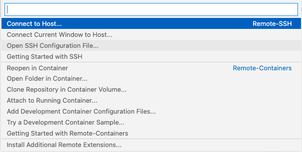

# Lab Report 3

In this lab report I will go over streamlining ssh configuration, setting Github access from ieng6, and copying whole difrectories with scp -r command. 

# Task 1: Streamlining ssh Configuration 



This is how I accessed the config file in VSCode.

 

This is the config file that I used and I edited it on VSCode. 


The command that I used which streamlined my login to the ieng6 server was ssh ieng6. 


This is the command that I used to copy the file MarkdownParse.java using the alias ieng6 specificed in the ssh config file. 

# Task 2: Setup Github Access from ieng6 

First I checked for ssh public and private keys on my local machine that were generated using ssh keygen. The private key and public keys are stored in the ~/.ssh folder as shown below.


Registered public key on github. Go to settings and click ssh and gpg keys. Then I clicked add new ssh key.


Copied and pasted my public ssh key and saved it to Github.


I copied the ssh keys from my local machine to the server ieng6 and modified the ssh config file to add the git server information.


Edited MarkdownParse.java file. Used git commands to push the change onto github.

 

I generated a personal access token as a password is no longer accepted. 


[Link for resulting commit](https://github.com/smallinaUCSD/markdown-parser/commits/main)

# Task 3: Copy whole directories with scp -r

I copied the directory markdown-parser with the recursive scp command: 

```
scp -r /Users/smallina/Documents/GitHub/markdown-parser ieng6:~/markdown-parser
```


I compiled and ran the java file on the server.  


To copy folder, compile, and run on the server using a single line command: 

```
scp -r /Users/smallina/Documents/GitHub/markdown-parser ieng6:~/markdown-parser; ssh ieng6 cd markdown-parser; javac MarkdownParse.java; java MarkdownParse Test1.md
```


# Conclusion

In this lab report I went over streamlining ssh configuration, setting Github access from ieng6, and copying whole directories with scp -r command and a combine command with scp -r and ssh to copy whole directory, compile and run the java file. Thanks for reading.