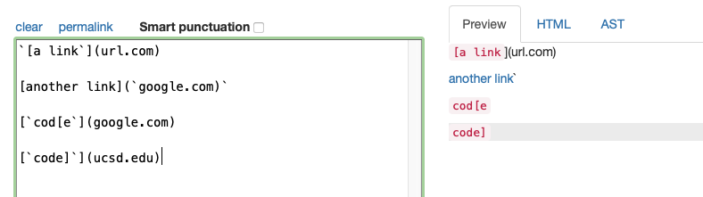
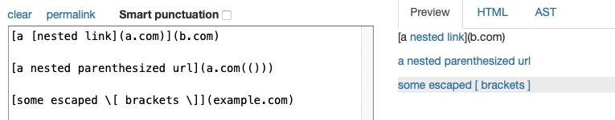
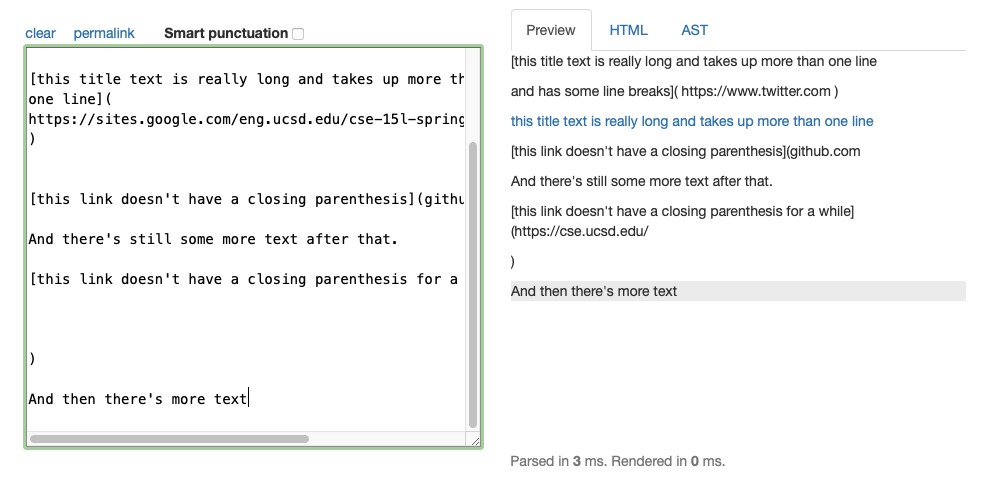
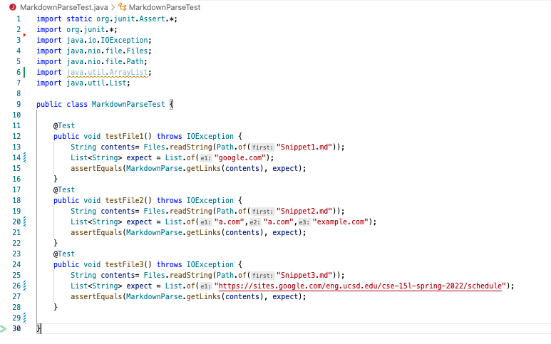
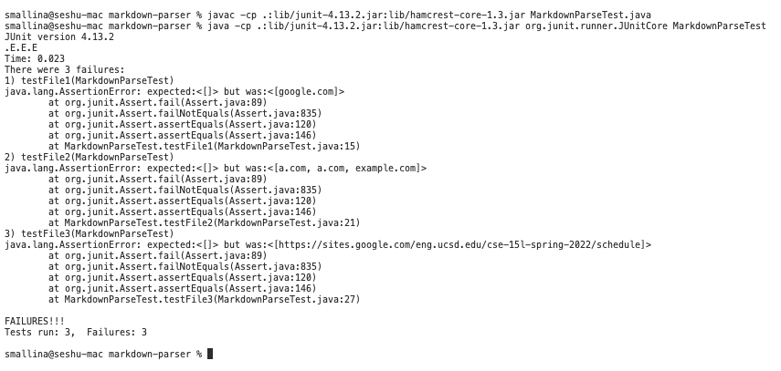
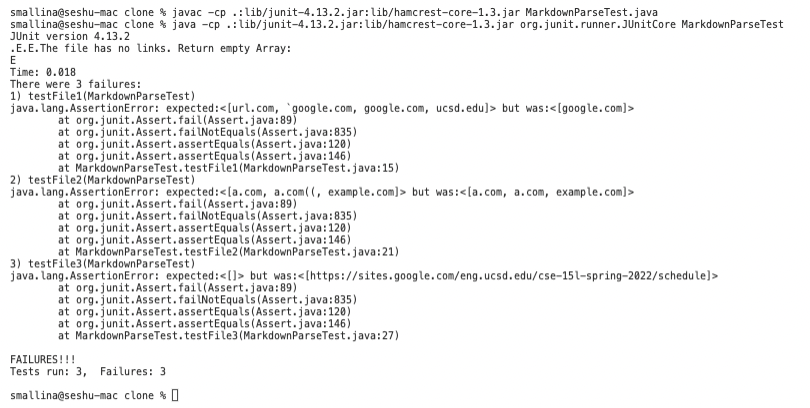

# Lab Report 4

[Link to my Git repo](https://github.com/smallinaUCSD/markdown-parser)

[Link to Git repo from week 7](https://github.com/Trinnnn/markdown-parser)

I cloned this repository into a folder called clone using github desktop. 

For the following snippets I will be using [this link](https://spec.commonmark.org/dingus/) which shows the preview of HTML/Markdown code.

## Snippet 1

```
`[a link`](url.com)

[another link](`google.com)`

[`cod[e`](google.com)

[`code]`](ucsd.edu)
```



As seen in the screenshot above another link is the only valid link in the code snippet. Therefore the expected output should be [google.com]. 

## Snippet 2

```
[a [nested link](a.com)](b.com)

[a nested parenthesized url](a.com(()))

[some escaped \[ brackets \]](example.com)
```



As seen in the screenshot above nested link, a nested parenthesized url, and some escaped [brackets] are valid links in the code snippet. Therefore the expected output should be [a.com,a.com,example.com]. 

## Snippet 3

```
[this title text is really long and takes up more than 
one line

and has some line breaks](
    https://www.twitter.com
)

[this title text is really long and takes up more than 
one line](
https://sites.google.com/eng.ucsd.edu/cse-15l-spring-2022/schedule
)


[this link doesn't have a closing parenthesis](github.com

And there's still some more text after that.

[this link doesn't have a closing parenthesis for a while](https://cse.ucsd.edu/


)

And then there's more text
```



As seen in the screenshot above this title text is really long and takes up more than one line is the only valid link in the code snippet. Therefore the expected output should be: [https://sites.google.com/eng.ucsd.edu/cse-15l-spring-2022/schedule,https://cse.ucsd.edu/]

# Code for MarkdownParseTest



```
import static org.junit.Assert.*;
import org.junit.*;
import java.io.IOException;
import java.nio.file.Files;
import java.nio.file.Path;
import java.util.ArrayList;
import java.util.List;

public class MarkdownParseTest {

    @Test
    public void testFile1() throws IOException {
        String contents= Files.readString(Path.of("Snippet1.md"));
        List<String> expect = List.of("google.com");
        assertEquals(MarkdownParse.getLinks(contents), expect);
    }
    @Test
    public void testFile2() throws IOException {
        String contents= Files.readString(Path.of("Snippet2.md"));
        List<String> expect = List.of("a.com","a.com","example.com");
        assertEquals(MarkdownParse.getLinks(contents), expect);
    }
    @Test
    public void testFile3() throws IOException {
        String contents= Files.readString(Path.of("Snippet3.md"));
        List<String> expect = List.of("https://sites.google.com/eng.ucsd.edu/cse-15l-spring-2022/schedule");
        assertEquals(MarkdownParse.getLinks(contents), expect);
    }

}
```

# My Implementation Result


When I ran the test file all three snippet failed. 

# Week 7 Implementation Result 


When I ran the test file all three snippets failed. 

# Question 1
**Question:**
Do you think there is a small (<10 lines) code change that will make your program work for snippet 1 and all related cases that use inline code with backticks? If yes, describe the code change. If not, describe why it would be a more involved change.

**Response:**  
I believe a minor code change is required. I would include an if condition to determine whether the character \` is in the current line. If the character is present, we can write code to skip the character because links with correct syntax do not contain the \` chracter. One solution I propose for this problem is to write a helper method that removes all instances of the \` character in the current line.

# Question 2
**Question:**
Do you think there is a small (<10 lines) code change that will make your program work for snippet 2 and all related cases that nest parentheses, brackets, and escaped brackets? If yes, describe the code change. If not, describe why it would be a more involved change.

**Response:**  
I believe a significant code change is required. I'd use a data structure similar to a stack to push whenever a [,( appears and pop whenever its inverse appears. We'd also have to account for the case where the stack isn't empty by the end of the line. We can conclude that this is a significant code change because it makes use of a data structure, instance variables, and possibly helper methods. 
 
# Question 3
**Question:**
Do you think there is a small (<10 lines) code change that will make your program work for snippet 3 and all related cases that have newlines in brackets and parentheses? If yes, describe the code change. If not, describe why it would be a more involved change.

**Response:**  
A significant code change, in my opinion, is required. As previously stated, I would use a data structure such as a stack to keep track of parentheses and brackets. I'd also have an if condition that checks to see if the stack is empty; if it isn't, I'd concatenate the next lines until the stack is empty. Once the stack is empty, we can parse and retrieve the links using the getLinks() method. We can conclude that this will be a significant code change because it will use data structures, variables, and helper methods. 


