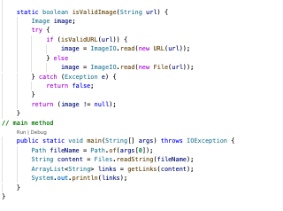

# Lab Report 4

[Link to Git repo from week 7](https://github.com/Trinnnn/markdown-parser)

I cloned this repository into a folder called clone using github desktop. 

## Snippet 1

Expected output: []

```
`[a link`](url.com)

[another link](`google.com)`

[`cod[e`](google.com)

[`code]`](ucsd.edu)
```


When looking at the VSCode Preview for Snippet 1 none of the links were accessible as a result the expected output is an empty array. 

## Snippet 2

Expected output: []

```
[a [nested link](a.com)](b.com)

[a nested parenthesized url](a.com(()))

[some escaped \[ brackets \]](example.com)
```



When looking at the VSCode Preview for Snippet 2 none of the links were accessible as a result the expected output is an empty array. 

## Snippet 3

Expected output: [https://www.twitter.com, https://sites.google.com/eng.ucsd.edu/cse-15l-spring-2022/schedule,https://cse.ucsd.edu/]

```
[this title text is really long and takes up more than 
one line

and has some line breaks](
    https://www.twitter.com
)

[this title text is really long and takes up more than 
one line](
https://sites.google.com/eng.ucsd.edu/cse-15l-spring-2022/schedule
)


[this link doesn't have a closing parenthesis](github.com

And there's still some more text after that.

[this link doesn't have a closing parenthesis for a while](https://cse.ucsd.edu/


)

And then there's more text
```


When looking at the VSCode Preview for Snippet 3 there are 3 links that are accessible. As a result the expected output is an array that contains the three working links.

# Code for MarkdownParseTest


```
import static org.junit.Assert.*;
import org.junit.*;
import java.io.IOException;
import java.nio.file.Files;
import java.nio.file.Path;
import java.util.ArrayList;
import java.util.List;

public class MarkdownParseTest {

    @Test
    public void testFile1() throws IOException {
        String contents= Files.readString(Path.of("Snippet1.md"));
        List<String> expect = List.of();
        assertEquals(MarkdownParse.getLinks(contents), expect);
    }
    @Test
    public void testFile2() throws IOException {
        String contents= Files.readString(Path.of("Snippet2.md"));
        List<String> expect = List.of();
        assertEquals(MarkdownParse.getLinks(contents), expect);
    }
    @Test
    public void testFile3() throws IOException {
        String contents= Files.readString(Path.of("Snippet3.md"));
        List<String> expect = List.of("https://www.twitter.com","https://sites.google.com/eng.ucsd.edu/cse-15l-spring-2022/schedule","https://cse.ucsd.edu/");
        assertEquals(MarkdownParse.getLinks(contents), expect);
    }

}
```

# My Implementation Result


When I ran the test file the third snippet failed. 

# Week 7 Implementation Result 


When I ran the test file all three snippets failed. 

# Question 1
**Question:**
Do you think there is a small (<10 lines) code change that will make your program work for snippet 1 and all related cases that use inline code with backticks? If yes, describe the code change. If not, describe why it would be a more involved change.

**Response:**  
A small code change is required to check for ` character and the wellformness of the syntax. The code change would need to include code that skips the character ` when parsing. 


# Question 2
**Question:**
Do you think there is a small (<10 lines) code change that will make your program work for snippet 2 and all related cases that nest parentheses, brackets, and escaped brackets? If yes, describe the code change. If not, describe why it would be a more involved change.

**Response:**  
A small code change is required to handle nested parenthesis, brackets, and escaped brackets. The code change would need to include code that would parse individual lines to check for nested parenthesis, brakcets, and excape brackets. 

# Question 3
**Question:**
Do you think there is a small (<10 lines) code change that will make your program work for snippet 3 and all related cases that have newlines in brackets and parentheses? If yes, describe the code change. If not, describe why it would be a more involved change.

**Response:**  
A small code change is required to handle new lines in brackets and parenthesis, and missing parenthesis. The code change would need to include code that would parse individual lines to check for new lines and missing parenthesis and brackets.

