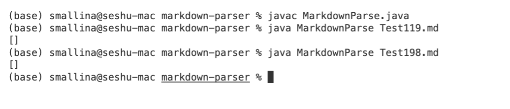

# Lab Report 5

# Finding Tests 

I found two tests that had different answers than the implementation that was provided by searching through the test cases manually and testing each one until I found something that did not match. 

# Link to two test 

[Link for test 1](https://github.com/nidhidhamnani/markdown-parser/blob/main/test-files/198.md)

[Link for test 2](https://github.com/nidhidhamnani/markdown-parser/blob/main/test-files/119.md)

For this lab I used [this link]() which shows markdown code preview. 

# Test 1 and 2 


The expected output for test **198.md** should be foo since its a valid link in the preview. 
```
Expected output: [https://spec.commonmark.org/url]
```


The expected output for test **119.md** should be no links as seen in the preview there is no valid link present. 
```
Expected output: []
```

 

This is my output. The test for **119.md** passed as my output **[]** matched the expected output **[]**. However, for test **198.md** my output **[]** did not match the expected output of [https://spec.commonmark.org/url]. My output for test **198.md** was missing the link. 


# Fix the bug 


According to [daring fireball](https://daringfireball.net/projects/markdown/syntax#link) there are multiple different ways to have links in a markdown file. In the case that failed, the close bracked was follwed by a :. This is another way of having a link in a markdown file. One code fix that I suggest for this would be either adding helper methods that check for valid syntax. Another possible code suggestions would be to have additional if statements to check to see if the next character after a close bracket is a :. Lastly, when parsing the link after the colon its important to check for additional text after the link as is not part of the link as shown in the picture below.


