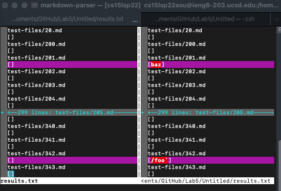
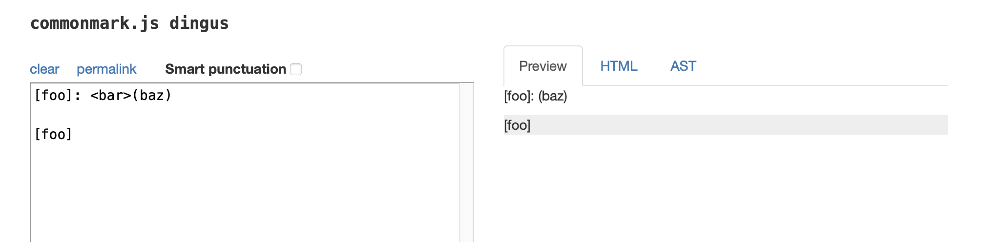
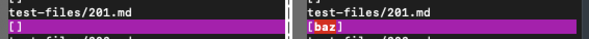
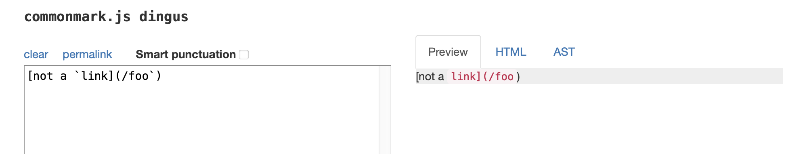
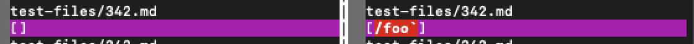
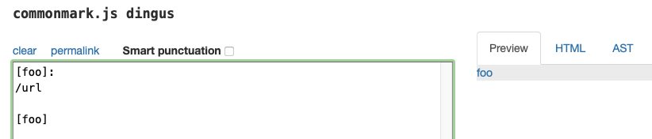
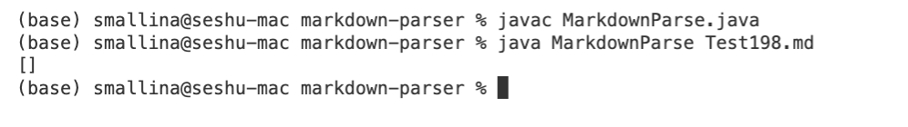
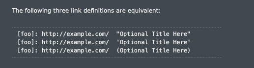

# Lab Report 5

## Finding Tests 

I first cloned this [repository](https://github.com/nidhidhamnani/markdown-parser.git)

Then I copied over the folder test-files from the source folder to my markdown-parser using the command:

```
cp -r /Users/smallina/Documents/GitHub/Lab5/Untitled/test-files markdown-parser
```

I renamed the file using this command:

```
mv /Users/smallina/Documents/GitHub/markdown-parser/markdown-parser /Users/smallina/Documents/GitHub/markdown-parser/test-files
```

I then copied over the file script.sh using the command 

```
cp /Users/smallina/Documents/GitHub/Lab5/Untitled/script.sh markdown-parser
```

I renamed the file using this command:

```
mv /Users/smallina/Documents/GitHub/markdown-parser/markdown-parser /Users/smallina/Documents/GitHub/markdown-parser/script.sh 
```

I ran the command in both my markdown-parser and cloned markdown-parser. This command copied the results of markdown parser and each file and the resulting outputs.

```
bash script.sh > results.txt
```

I then used this command to compare the results of the two different results.txt files. 

```
vimdiff /Users/smallina/Documents/Github/markdown-parser/results.txt /Users/smallina/Documents/GitHub/Lab5/Untitled/results.txt
```



## Differing Test Files

As seen from the vimdiff screenshot above we can see that test 201.md and test 342.md have different outputs. Test 201.md and test 342.md are the two tests that I chose for this lab report and the links to the tests are below. 

[Link for test 201](https://github.com/nidhidhamnani/markdown-parser/blob/main/test-files/201.md)

[Link for test 342](https://github.com/nidhidhamnani/markdown-parser/blob/main/test-files/342.md)


## Test 201 and 342 

For this lab I used [this link](https://spec.commonmark.org/dingus/) which shows markdown code preview. 

**Test 201.md**



As seen from the screenshot above the expected output is supposed to empty as there are no valid links in the file. 

```
Expected output: []
```



Concluding that the expected output of the 201.md is supposed to be [], we can see that my code returns the correct answer, while the code given returns [baz]. 

**Test 342.md**

 

As seen from the screenshot above the expected output is supposed to empty as there are no valid links in the file. 

```
Expected output: []
```



Concluding that the expected output of the 201.md is supposed to be [], we can see that my code returns the correct answer, while the code given returns [/foo`]. 

## Bug Fixes

Both test 201.md and 342.md worked with my code, but I skimmed through the other test files. I copied their contents and compared my output with the correct one using the link provided above. Test 198.md made my code break.

[Link to test 198](https://github.com/nidhidhamnani/markdown-parser/blob/main/test-files/198.md)

**Contents of Test 198.md:**

```
[foo]:
/url

[foo]
```

**Expected Output:**


**My output:**


For test 198.md there is an expected output [https://spec.commonmark.org/url]. However my code returns []. 

**My Code That needs to be modified:**


According to [daring fireball](https://daringfireball.net/projects/markdown/syntax#link) there are multiple different ways to have links in a markdown file. In the case that failed, the close bracked was follwed by a colon (]:) . This is another way of having a link in a markdown file. One code fix that I suggest would be adding helper methods that check for valid syntax. Another possible code suggestion would be to have additional if statements to check to see if the next character after a close bracket is a colon. Lastly, when parsing the link after the colon its important to check for additional text after the link as is not part of the link as shown in the picture below.




