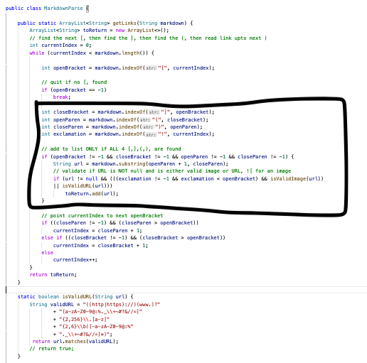

# Lab Report 5

# Finding Tests 

    I found two tests that had different answers than the implementation that was provided by searching through the test cases manually and testing each one until I found something that did not match. 

# Link to two test 

[Link for test 1](https://github.com/nidhidhamnani/markdown-parser/blob/main/test-files/198.md)

[Link for test 2](https://github.com/nidhidhamnani/markdown-parser/blob/main/test-files/119.md)

For this lab I used [this link]() which shows markdown code preview. 

# Test 1 and 2 

Code for testing: 

```
import static org.junit.Assert.*;
import org.junit.*;
import java.io.IOException;
import java.nio.file.Files;
import java.nio.file.Path;
import java.util.ArrayList;
import java.util.List;

public class MarkdownParseTest {

    @Test
    public void testFile1() throws IOException {
        String contents= Files.readString(Path.of("Test4.md"));
        List<String> expect = List.of();
        assertEquals(MarkdownParse.getLinks(contents), expect);
    }
    @Test
    public void testFile2() throws IOException {
        String contents= Files.readString(Path.of("Test5.md"));
        List<String> expect = List.of("https://spec.commonmark.org/url");
        assertEquals(MarkdownParse.getLinks(contents), expect);
    }
}
```

 

This is my output. The second test (119.md) passed however the first one failed (198.md). The implementation for test 119.md is correct however for test 198.md it is incorrect.


This is their output. The second test (119.md) passed however the first one failed (198.md). The implementation for test 119.md is correct however for test 198.md it is incorrect.


The expected output for test 1 should be foo since its a valid link in the preview. 


The expected output for test 2 should be no links as seen in the preview there is no valid link present. 

# Fix the bug 




According to [daring fireball](https://daringfireball.net/projects/markdown/syntax#link) there are multiple different ways to have links in a markdown file. In the case that failed, the link was followed by a : which is another way of having a link in a markdown file. The code fix for this would be either adding helper methods or additional if statements to check to see if the next character after a close bracket is a : and to check if there additional text after the link which needs to removed as its not part of the link as shown below.


